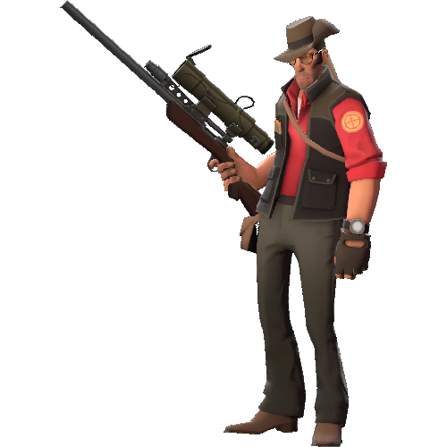

<h1 align="center">Team Fortress 2 Aimbot Tower</h1>

This is a joke tower inspired by Team Fortress 2 Bots

<h1> Warning </h1>
By default, the tower will randomly yell out vocal lines from Team Fortress 2, some of these lines include swearing and harsh language. If you wish to disable these vocal lines, go to TF2 Aimbot Sniper's Settings in the Mod Menu and disable them.

